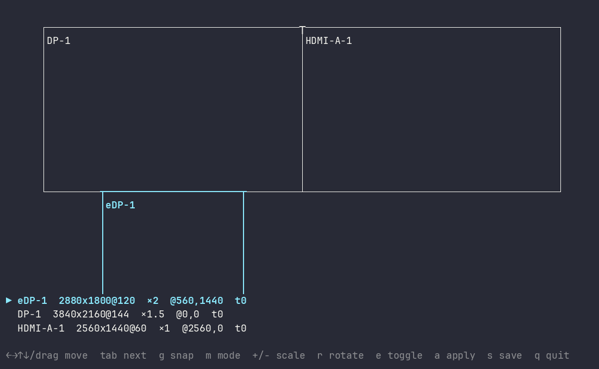

# fast-hyprmon

A tiny, fast terminal UI for arranging monitors in Hyprland.

<p align="center"></p>

- **Zero dependencies.** One 456 KB binary.
- **Instant.** Talks to Hyprland's socket directly and redraws only on input.
- **Drag and snap.** Move monitors with the mouse or keyboard; edges snap together.
- **Safe.** Every apply reverts after 10 seconds unless you confirm it.

## Install

```sh
cargo install --git https://github.com/AronTurner/fast-hyprmon
```

## Usage

Run `fast-hyprmon`.

| Key | Action |
|-|-|
| Click, drag | Select, move |
| `←` `→` `↑` `↓` | Move one cell (10px with Shift) |
| `Tab` / `Shift+Tab` | Next / previous monitor |
| `g` | Snap to nearest monitor |
| `m` | Cycle mode |
| `+` / `-` | Scale |
| `r` | Rotate |
| `e` | Enable / disable |
| `a` | Apply |
| `s` | Save |
| `q` | Quit |

Monitors snap to each other's edges as you move them, and snapped edges join into a single line. After applying, press `y` to keep the layout or `n` to revert. It reverts on its own after 10 seconds.

## Saving

`s` writes your layout to a file that matches your Hyprland config format:

| Config | Writes | Add to your config |
|-|-|-|
| `hyprland.conf` | `~/.config/hypr/monitors.conf` | `source = ~/.config/hypr/monitors.conf` |
| `hyprland.lua` | `~/.config/hypr/monitors.lua` | `dofile(os.getenv("HOME") .. "/.config/hypr/monitors.lua")` |

## Performance

| | |
|-|-|
| Startup to first frame | 3.9 ms |
| Keypress to screen | 0.4 ms |
| Idle CPU | 0 |
| Memory | 2.2 MB |
| Binary | 456 KB |

Medians over 15 sessions of 50 keypresses each, in a 120×40 terminal.

## License

MIT
